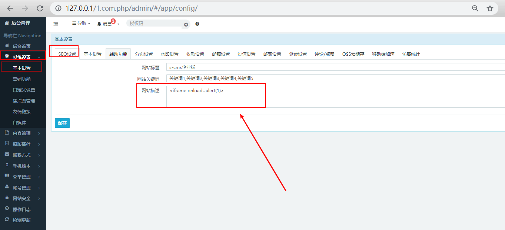
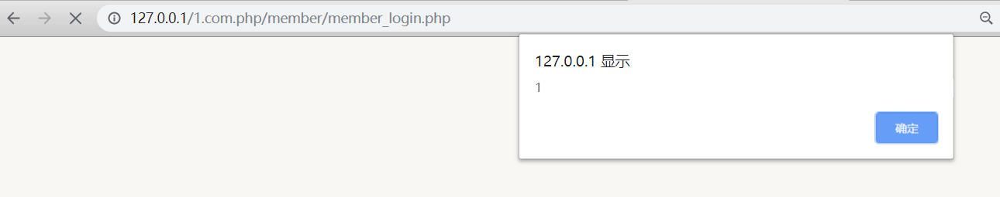

## S-CMS PHP v3.0 website description storage XSS

There is a storage XSS vulnerability in the background of the s-cms enterprise website building system (PHP version). The attacker logs in to the administrator background and puts malicious js code,serious threat to network security.

## exploit

### 1 Client login to management system, `系统设置`->`基本设置`->`SEO设置`，input `<iframe onload=alert(1)>`,then click save.

### 2 Visit the membership login page,trigger storage XSS vulnerability.

### 3 Vulnerability system is the latest version，[S-CMS Enterprise Station Building System (php version)v3.0](https://cdn.shanling.top/file/1.com.php.zip)